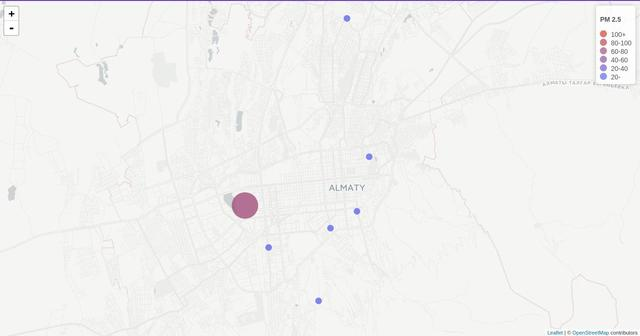
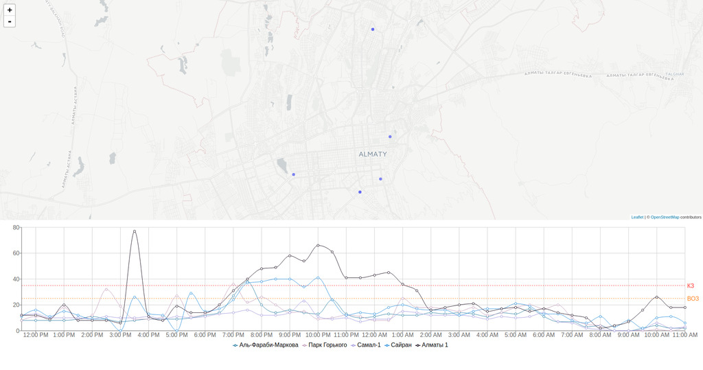

Air pollution problem become very popular in Almaty in recent years. It is noticable especially in autumn and winters, when people from lower parts of the city use coal in their heating systems.


Until last year there were no independent sources to measure pollution. In the beginning of 2017 this [guy](https://www.facebook.com/people/Павел-Александров/) started initiative installing 4 sensors(now 8) to measure fine particles in the air. I believe these sensors are made from arduino with sensors connected. Data sent and stored at [thingspeak.com](thingspeak.com/channels/)

So as a side project I wanted to make web app, that can visualize data. Of course in react.

App requirements:

- Show current pollution level
- Show sensors and corresponding data on map
- Show graphs for day and historical data

I chose highmaps at first and made GeoJSON of [Almaty](https://github.com/akilbekov/almaty.geo.json) only to find out that highmaps do not support custom GeoJSON without correct proj4 properties. While searching for solution I found leaflet.js and leaflet-react wrapper.

First I mapped sensors, using provided by API latitude and longitude.

```js
    drawSensors = (sensors) => {
      return sensors.map(s =>
        <;Circle
          id={s.id}
          onClick={this.handleSensorClick}
          key={s.name}
          center={[s.lat, s.lon]}
          fillColor={this.getColor(s.pm)}
          radius={this.getRadius(s.pm)}
          weight={1}
          opacity={0}
          fillOpacity={0.8}
        />
      );
    }
```



After I started looking for react charting library. Unfortunately, there is not much to choose from.

- **react-highcharts** - react wrapper around highcharts
- **recharts** - good library, with nice defaults
- **vx** - super new and promising
- **victory** - nice, but you default styling is not for my liking

```js
<ResponsiveContainer width="100%" aspect={5} style={{ opacity: 0.1 }}>
  <LineChart data={this.props.data} margin={{ top: 50, right: 50, left: 0, bottom: 50 }}>
    <XAxis dataKey={data => moment(data.created_at).format('LT')} />
    <YAxis />
    <Line
      type="monotone"
      dataKey={data => +data.field3}
      stroke="#247BA0"
      name={data[0].name}
      dot={false}
    />
    ...
    <ReferenceLine y={25} label="ВОЗ" stroke="#FF851B" strokeDasharray="3 3" />
    <ReferenceLine y={35} label="КЗ" stroke="#FF4136" strokeDasharray="3 3" />
    <CartesianGrid stroke="#ccc" />
    <Legend margin={{ top: 30 }} />
    <Tooltip />
  </LineChart>
</ResponsiveContainer>
```

I spend most of the time formatting data to be consumed by charting component.



So far I like what I end up with, however with 8 sensors I have to make same amount fetch requests to thingspeak.com. And it's not fast, also it has limitation for request results.

As next thing to do is optimize requests, by building simple API which will consolidate requests into one.
