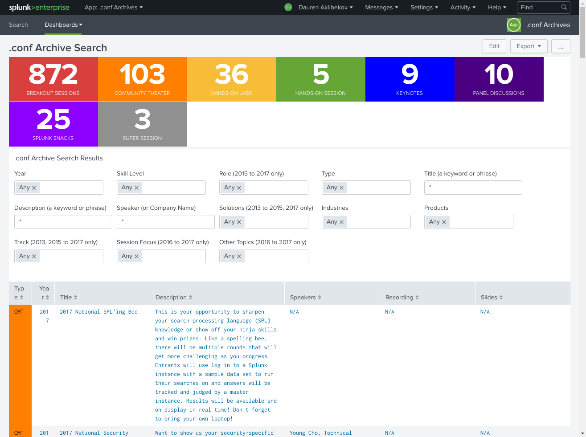

### Docs

I've started using Splunk half a year ago. So far, got Splunk Admin and few other partner accreditation, like Sales Engineer 1. I think the best place to learn Splunk is official [documentation](http://docs.splunk.com/Documentation).

It is good idea to look at Splunk [best practices doc](https://wiki.splunk.com/Deploy:More_best_practices_and_processes), because sometimes admins develop their own "best practices" and can it can be suboptimal.

### Answers

Other places to look [Answers](https://answers.splunk.com) - the stackoverflow-like site. Some answers are pure gems [1](https://answers.splunk.com/answers/186938/what-is-tstats-and-why-is-so-much-faster-than-stat.html), [2](https://answers.splunk.com/answers/129424/how-to-compare-fields-over-multiple-sourcetypes-without-join-append-or-use-of-subsearches.html). Questions answered by experts and Spunk employees. As a reward, every year they award best of the best with [tickets](https://www.splunk.com/blog/2018/03/22/congrats-to-the-winner-of-the-february-2018-karma-competition-on-splunk-answers.html) to **.conf**.

### .conf

**.conf** is a annual conference where Splunk announces new features, experts give talks on different subject from monitoring to securtiy. Almost all talks were recorded and have slides shared, as expected there is [app](https://splunkbase.splunk.com/app/3330/) for the conference. As a daily routine I randomly (this apps needs "random" button) watch one talk. Some of the talks [1](https://conf.splunk.com/files/2017/slides/searching-fast-how-to-start-using-tstats-and-other-acceleration-techniques.pdf), [2](https://conf.splunk.com/files/2017/slides/effectively-enhancing-our-soc-with-sysmon-powershell-logging-and-machine-learning-to-detect-and-respond-to-todays-threats.pdf) are amazing and cover things not in docs or courses.

### Courses

Splunk offers free Fundamentals 1 and Fundamentals 2 (if you are a partner), which correspond to Splunk User and Power User certifications.
In my oppinion these two are the best courses to get started. Admin and Architect courses are ok. Starting Autumn 2018, Splunk will use PearsonVUE as platform for certification.

There are also courses available on a partner portal, mainly for partner accreditations.

### Books

[Splunk 7 Essentials](https://www.packtpub.com/big-data-and-business-intelligence/splunk-7-essentials-third-edition) is a good overview of the platform.

### Blogs

- https://www.function1.com/tags/splunk
- https://www.aplura.com/resources
- https://www.hurricanelabs.com/blog
- https://www.volgablob.ru/blog
- https://www.splunk.com/blog/homepage.html
- https://uberagent.com/blog
- http://www.baboonbones.com/blog
- https://www.pixelchef.net/splunk
- https://www.davidveuve.com
- http://www.georgestarcher.com
- https://www.aditumpartners.com/splunk-resources/blog
