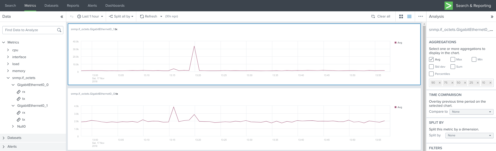

Splunk is amazing tool for analyzing data, if you know how to get it inside. Normally Splunk relies on using Forwarders and needed add-ons to collect and add meta-information to data. But sometimes this is not an option, for example SNMP (Splunk supports SNMP traps). For SNMP you can use third-party modular inputs [1](https://splunkbase.splunk.com/app/1537/), [2](https://splunkbase.splunk.com/app/2673/) to solve this. Unfortunately SNMP Modular Input doesn't work reliably, I believe problem lies in very old version of **pysnmp**. And the latter only works for polling interfaces on network devices. There is also option to use PRTG or cacti and then send them to Splunk.

Recently Splunk introduced metrics - very fast compared to traditional event indexes and easy way to ingest them, HTTP Event Collector. On the client side we can use [collectd](https://collectd.org), without installing forwarders. Functionality of collectd can be complemented by array of plugins.

## Configure HEC on Splunk

On the Splunk side we need to enable HEC to receive data sent from collectd enabled host. First create metrics index and then follow this [guide](http://docs.splunk.com/Documentation/Splunk/7.2.1/Metrics/GetMetricsInCollectd#Configure_the_HTTP_Event_Collector_.28HEC.29_data_input).

## collectd configuration

Download and install **collectd** and plugins on the host which will poll SNMP devices:

```sh
# yum install epel-release
# yum install collectd
```

Download [Splunk App for Infrastructure](https://splunkbase.splunk.com/app/3975/) and extract /splunk\_app\_infrastructure/appserver/static/unix_agent/unix-agent.tgz. Copy **write_splunk.so** to /usr/lib/collectd/. This path can be different consult #PluginDir line in collectd.conf or change it to your liking. The plugin works as write_http, but can add dimensions to sent metrics.

and SNMP packages:

```sh
# yum install net-snmp net-snmp-libs net-snmp-utils
```

To use MIBs, put them in default directories:

```sh
$HOME/.snmp/mibs
/usr/local/share/snmp/mibs
```

Configure SNMP plugin and sending data to Splunk:

```sh
# cd /etc/collectd/collectd.conf.d
# vim snmp.conf
```

```xml
#File: /etc/collectd/collectd.conf.d/snmp.conf

LoadPlugin snmp

<Plugin snmp>
  <Data "std_traffic">
    Type "if_octets"
    Table true
    Instance "IF-MIB::ifDescr"
    Values "IF-MIB::ifInOctets" "IF-MIB::ifOutOctets"
  </Data>
  <Host "my.lab.dev">
    Address "192.168.10.1"
    Version 2
    Community "public"
    Collect "std_traffic"
    Interval 60
  </Host>
</Plugin>
```

```xml
#File: /etc/collectd/collectd.conf.d/write_splunk.conf

<LoadPlugin "write_splunk">
  FlushInterval 10
</LoadPlugin>

<Plugin write_splunk>
  server "<splunk app server>"
  port "8088"
  token "<HEC TOKEN from first step>"
  ssl true
  verifyssl false
  key1:value1
</Plugin>
```

Now we enable and start collectd service:

```sh
# systemctl enable collectd.service
# systemctl start collectd.service
```

## Metrics Workspace



The best way to start to work with the metrics vizualisation is to install [Metrics Workspace](https://splunkbase.splunk.com/app/4192/) app. This app will add tab to your search app, it automatically pulls your metrics and gives you easy to use interface for visualizing them.
