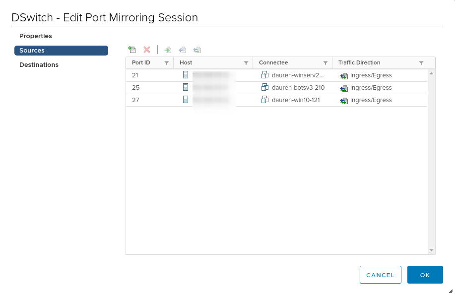

When it comes to collecting packets for IDS/IPS tutorials usually recommend using "Promiscous Mode". ESXi has other way to sniff traffic, which can be handy when you want to do it temporarily or targeted.

To configure port mirroring session browse to Distributed Switch ❯ Manage ❯ Settings ❯ Port Mirroring.

We can choose sources and which traffic to mirror, egress or igress.

And finally destination.

