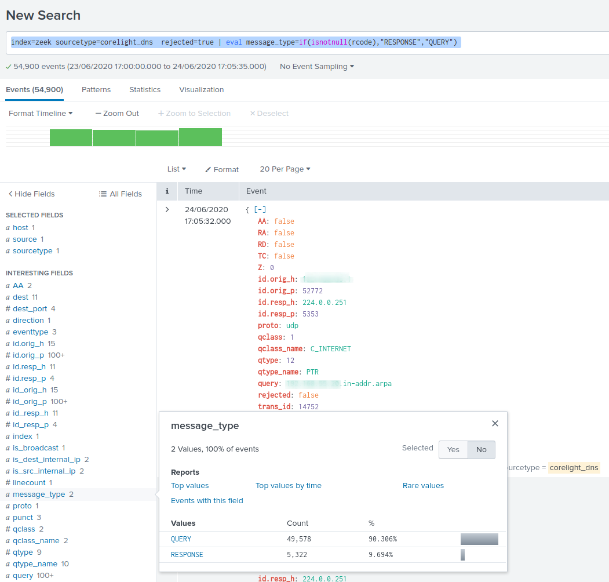
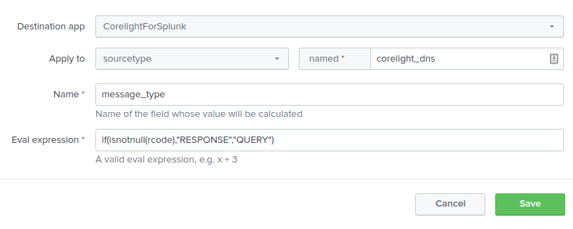
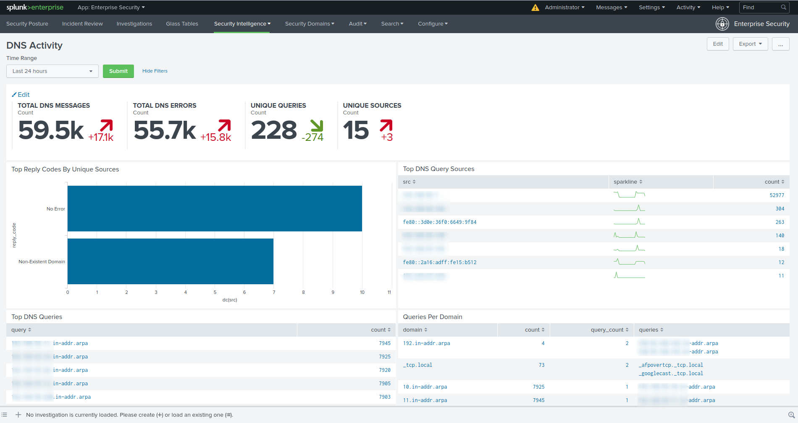

After installation of zeek (I've used great [Series of articles](https://www.ericooi.com/zeekurity-zen-part-i-how-to-install-zeek-on-centos-8/) from Eric Ooi), I've configured universal forwarder with a Corelight's add-on [TA for Corelight](https://splunkbase.splunk.com/app/3885/), although there is another version of the add-on from Splunk.

What I've noticed, is that Splunk Enterprise Security ❯ DNS Activity at dashboards weren't populating.

```splunk-spl
| tstats `summariesonly` dc(DNS.src) as dc(src) from datamodel=Network_Resolution.DNS where DNS.message_type="RESPONSE" by DNS.reply_code
| `drop_dm_object_name("DNS")`
| sort 10 - dc(src)
```

There is no message_type readily available, this field corresponds to QR flag in DNS header. Even though it was availble in previous versions of Zeek, it was [removed](https://github.com/zeek/zeek/commit/18f5018a0d6cb7e3595fb186d58016b9c2ce2843) due to wrong implementation.

If we check available fields from **sourcetype=corelight_dns**, some messages contain **rcode** - return code field, meaning that, this event is RESPONSE, while others are QUERY mesage types. We can test this:

```splunk-spl
index=zeek sourcetype=corelight_dns rejected=true
| eval message_type=if(isnotnull(rcode),"RESPONSE","QUERY")
```



To make it work in Splunk Enterprise Security, we need to add this to calculated fields.



alternatively we can add this to add-on's local [props.conf](https://docs.splunk.com/Documentation/Splunk/8.0.4/Knowledge/Configurecalculatedfieldswithprops.conf) on a search head.

```
[corelight_dns]
EVAL-message_type=if(isnotnull(rcode),"RESPONSE","QUERY")
```

And lastly rebuild data model for DNS, we have now all panels populated:


