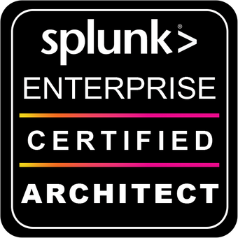

Hello, my name is Dauren. I'm cyber security professional employed by [ISSP](https://www.issp.com/). My interests include network security monitoring, incident response, SIEM solutions and DevOps.

  

    
  

  

    
  

My credentials include Splunk Enterprise Certified Architect, CCNA, MSCA, ITILv3. In 2020, I'm working towards OSCP and CySA+.
